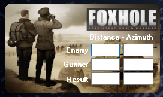
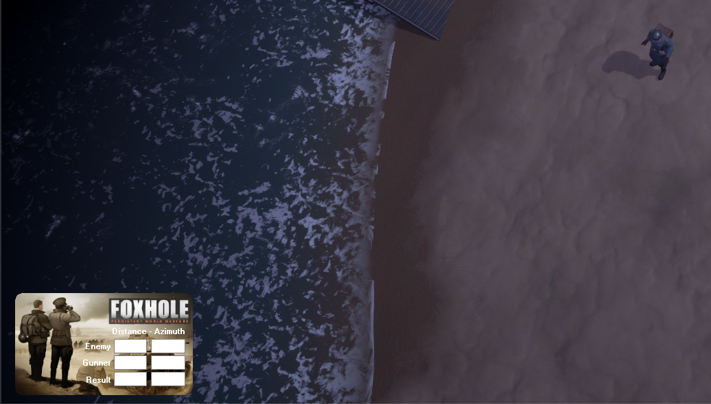
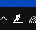

# FoxholeTool
Needed for foxhole game, eat while building! Starving doesn't help anybody...  
I find it really annoying to use the windows auto hold as it always activates when using the map or rifle. There may be other more generic tools to achieve the same but I don't care. It ist just right for Foxhole. The source is free, anyone is invited to change it as wanted. Please don't open issues with request for changing the keybinding. Clone - change - build and be happy.
  
Windows Defender is not happy about unsigned software. You may see a blue dialog where you have to confirm to go ahead. If you are unsure, build it yourself.

# Usage
F2 - use hammer, click left mouse button to stop  
F3 - open artillery calculator, while in game press F3 again to refocus for new distance.
     Press F3 twice to hide.  
  
  
  
Window can be moved freely. It is fairly small to allow for maximum game overview. You can drag the window around to your preferred corner.  
  
  
FoxholeTool is running in background and registers a handler in systray. To close just right click for context-menu and exit.  

  
  
The tool uses no magic. It just sends an left mouse button down event to windows without up event - that's it.  
As of the nature of windows window handling it works best in windowed fullscreen mode. You can still use it in fullscreen but it may not overlays correctly or windows are flashing. Foxhole sound is bound to active focus. While FoxholeTool is focused, you will hear no sound including ingame voices.
The result is always copied to clipboard for fast paste to chat.  

# How to build

Use Visual Studio 2019 to compile.
Prerequisite is WTL `https://wtl.sourceforge.io/`
Add WTL include dir to C++ Compiler additional include directories.

No MFC needed!

Forking is appreciated!
